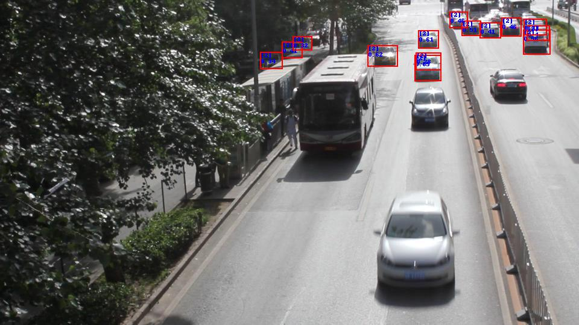
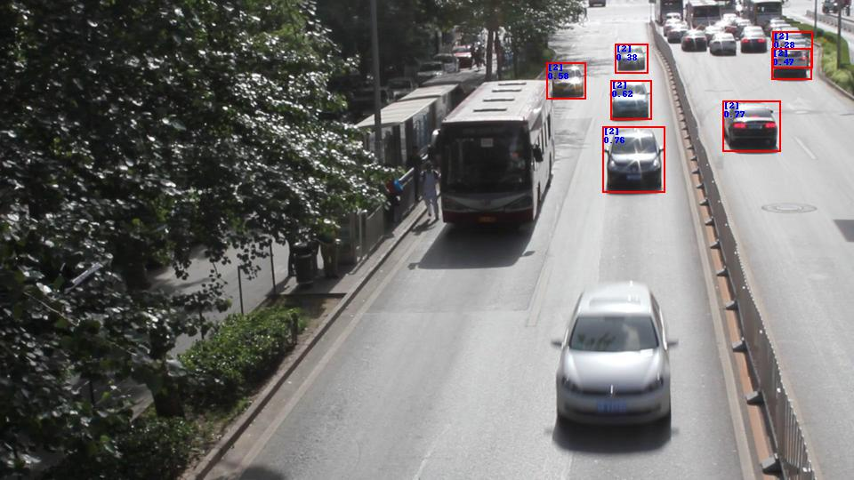
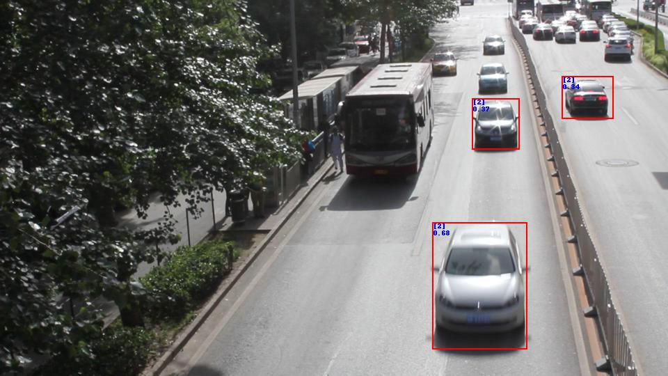
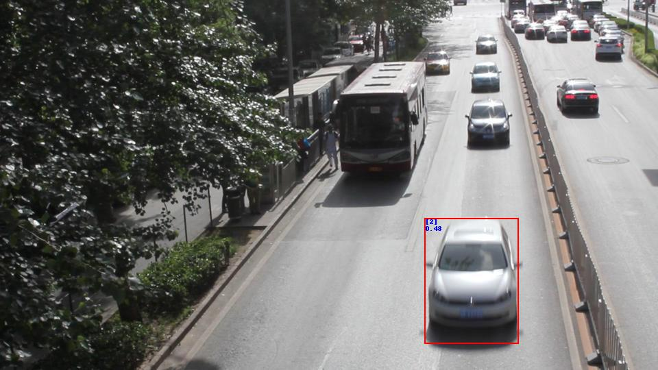
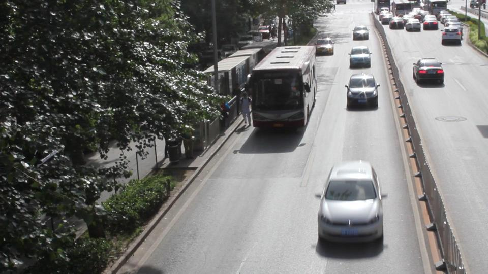

# RetinaNet-lab

This repository provides an easy way to do experiments with RetinaNet object detector. RetinaNet uses Feature Pyramid
Network (FPN) to deal with different object scales. There are 5 FPN levels, P3-P7, each level can detect objects with
different scales. I have modified [Nvidia implementation of RetinaNet](https://github.com/NVIDIA/retinanet-examples)
so that one can easily connect or disconnect different FPN levels to test their contribution in detecting objects.

The easiest way to run the code is to use docker. Please refer to [Nvidia implementation of RetinaNet](https://github.com/NVIDIA/retinanet-examples)
on how to use docker. Run the following command inside docker:
```
python retinanet/main.py infer  path-to-model.pth \
                                --images path-to-images \
                                --output path-to-detections.json \
                                --fpn-levels index-of-FPNs
```

Use the corresponding index according to this table:

| FPN level |P3 | P4 | P5 | P6 | P7 |
|---|---|---|---|---|---|
| Index | 0 | 1 | 2 | 3 | 4 |

To draw the bounding boxes overlaid on input images and save them:  
```  
python retinanet/main.py show   --input-images path-to-input-images \
                                --annotations path-to-detections.json \
                                --output-images path-to-output-images \
                                --score minimum-score-to-draw \
                                --category-ids index-of-categories-to-draw
```

For category-ids refer to COCO dataset.

## Examples:
* Running with ResNet18FPN as backbone and using P3:
```
    python retinanet/main.py infer  retinanet_rn18fpn.pth \
                                    --images path-to-images \
                                    --output detections.json \
                                    --fpn-levels 0
```

* Running with ResNet18FPN as backbone and using P3 and P4:
```
python retinanet/main.py infer  retinanet_rn18fpn.pth \
                                --images path-to-images \
                                --output detections.json \
                                --fpn-levels 0 1
```

* Draw bounding boxes in which score > 0.25 and category_id=2
```
python retinanet/main.py show   --input-images path-to-input-images \
                                --annotations detections.json \
                                --output-images path-to-output-images \
                                --score 0.25 \
                                --category-ids 2
```

## Case study:
Let's take the following image and see how different FPN levels, P3-P7, contribute in detecting cars (category_ids=2).
Detections with score below 0.25 were filtered out.

* Input image:
  


* P3: This FPN level detects the smallest scales in an image. As you can see cars that are closer to the camera, and
  thus appear big enough, are not detected by P3.



* P4: Some smaller cars that are detected by P3 are missing here, and some new cars are detected. As we see some cars
  are detected with both P3 and P4. 



* P5: Here is similar observation as P4. 



* P6: As we see here, only the closest car to the camera (the biggest car in the image) is detected by P6.



* P7: No car is detected by P7. The reason is that P7 is designed to detect really big objects and none of cars in this
  image are big enough to be detected by P7. 



